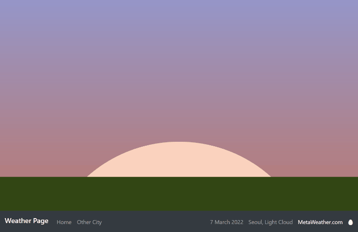
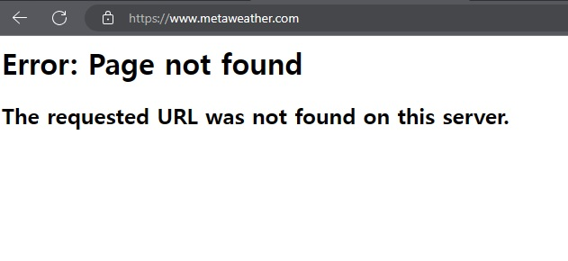

# Weather Website

It was my very first website.

A weather showing w ebsite, originally should display the weather of user's location on site's background.  
(Originally deployed on heroku)

Howerver, the weather API provided by Metaweather.com is not available anymore. Now it is renewed for user to change it manually. 
